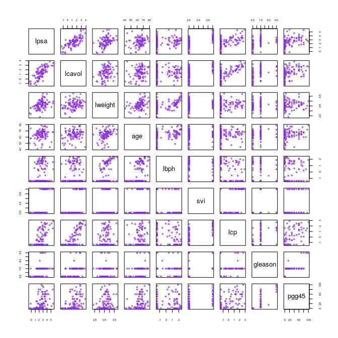
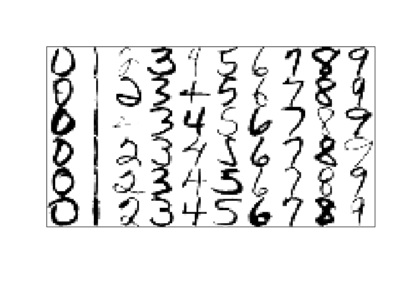
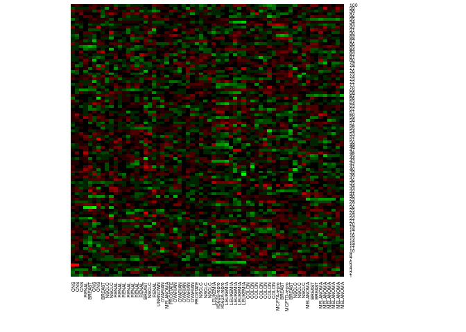

Chapter 1: Introduction
================
Bodo Burger

Examples of learning problems
=============================

Table 1-1 Spam data
-------------------

``` r
df.spam = mlr::spam.task$env$data
names(df.spam)[52] = "!" # change column name from "charExclamation" to "!"
spam = colMeans(df.spam[df.spam$type == "spam", -58])
email = colMeans(df.spam[df.spam$type == "nonspam", -58])
largest.diff = sort(abs(spam - email), decreasing = TRUE)[4:14]
knitr::kable(rbind(spam, email)[ ,names(largest.diff)], digits = 2)
```

|       |  george|   you|  your|    hp|  free|   hpl|     !|   our|    re|   edu|  remove|
|-------|-------:|-----:|-----:|-----:|-----:|-----:|-----:|-----:|-----:|-----:|-------:|
| spam  |    0.00|  2.26|  1.38|  0.02|  0.52|  0.01|  0.51|  0.51|  0.13|  0.01|    0.28|
| email |    1.27|  1.27|  0.44|  0.90|  0.07|  0.43|  0.11|  0.18|  0.42|  0.29|    0.01|

Figure 1-1 scatterplot matrix of prostate cancer data
-----------------------------------------------------

``` r
df.prostate = ElemStatLearn::prostate

pairs(df.prostate[, c("lpsa", "lcavol", "lweight", "age", "lbph", "svi", "lcp", "gleason", "pgg45")],
      col = "blueviolet", cex = .5, cex.axis = .5)
```



Figure 1-2 examples of handwritten digits from U.S. postal envelopes
--------------------------------------------------------------------



Figure 1-3 DNA microarray data
------------------------------

The data is from the NCI60 cancer microarray project (<http://genome-www.stanford.edu/nci60>).

``` r
df.nci = ElemStatLearn::nci
heatmap(df.nci[sample(nrow(df.nci), 100), ], Colv = NA, Rowv = NA, scale = "row",
        cexRow = .5, cexCol = .5, col = colorRampPalette(rev(c("green", "black", "red")))(15))
```



There are no grey cells representing missing values because these have already imputed and the names of the genes (rows) are not available.
