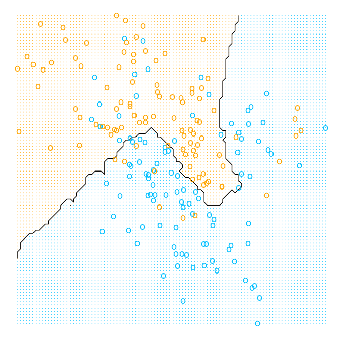
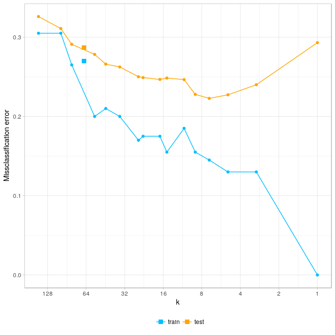
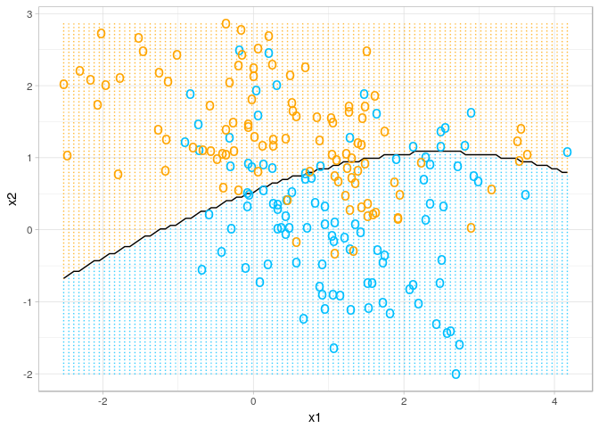

Chapter 2: Overview of Supervised Learning
================
Bodo Burger
2018-05

-   [Linear Model](#linear-model)
    -   [Figure 2-1 Classification using linear regression](#figure-2-1-classification-using-linear-regression)
-   [Nearest-Neighbors Method](#nearest-neighbors-method)
    -   [Figure 2-2 Classification using 15-nearest-neighbors](#figure-2-2-classification-using-15-nearest-neighbors)
    -   [Figure 2-3 Classification using 1-nearest-neighbor](#figure-2-3-classification-using-1-nearest-neighbor)
-   [Test error for k-nearest-neighbors](#test-error-for-k-nearest-neighbors)
    -   [Figure 2-4 Test error of nearest-neighbors for different k](#figure-2-4-test-error-of-nearest-neighbors-for-different-k)
-   [Local Methods in High Dimensions](#local-methods-in-high-dimensions)
    -   [Figure 2-6 Curse of dimensionality](#figure-2-6-curse-of-dimensionality)
    -   [Figure 2-7](#figure-2-7)
-   [Bonus figure: naive Bayes classifier](#bonus-figure-naive-bayes-classifier)
-   [Bonus figure: 67-nearest-neighbors](#bonus-figure-67-nearest-neighbors)
-   [Links](#links)

``` r
knitr::opts_chunk$set(echo = TRUE,
                      cache = TRUE,
                      cache.path = "cache/",
                      message = FALSE,
                      fig.path = "figures/")
set.seed(123)
library("mlr")
library("ggplot2")
#library("directlabels")
theme_set(theme_light())
```

Linear Model
============

The data is available from the ElemStatLearn package. We start by creating an MLR task and train a linear model to predict y.

``` r
me = ElemStatLearn::mixture.example
df = data.frame(x1 = me$x[,1], x2 = me$x[,2], y = me$y)
knitr::kable(df[sample(200, 4),], row.names = FALSE)
```

|          x1|         x2|    y|
|-----------:|----------:|----:|
|  -0.0771145|  0.5051217|    0|
|   3.1669716|  0.5569466|    1|
|   0.4708088|  0.0254386|    0|
|   1.9454294|  0.4810805|    1|

``` r
tsk = makeRegrTask(data = df, target = "y")
lrn.lm = makeLearner("regr.lm")
mod.lm = train(lrn.lm, tsk)
beta = coefficients(getLearnerModel(mod.lm))
knitr::kable(t(beta))
```

|  (Intercept)|         x1|         x2|
|------------:|----------:|----------:|
|    0.3290614|  -0.022636|  0.2495983|

We create a grid of points covering all realizations of *x*<sub>1</sub> and *x*<sub>2</sub> in the feature space. For each point we make a model prediction. We set the threshold for the classification to .5.

``` r
knitr::kable(summary(df[, c("x1", "x2")])[c(1,6), ], row.names = FALSE)
```

|       x1       |       x2       |
|:--------------:|:--------------:|
| Min. :-2.52082 | Min. :-1.99985 |
| Max. : 4.17075 | Max. : 2.85581 |

``` r
grid = expand.grid(x1 = seq(-2.6, 4.2, .1), x2 = seq(-2.0, 2.9, .05))
y.hat = getPredictionResponse(predict(mod.lm, newdata = grid))
grid["y.lm"] = factor(as.numeric(y.hat > .5))
```

The function for the decision boundary is determined by the estimated coefficients of the model.

``` r
db = function(x1, coef = beta) {
  (coef[3])^-1 * (0.5 - coef[1] - coef[2] * x1)
}
```

Figure 2-1 Classification using linear regression
-------------------------------------------------

``` r
ggplot(show.legend = FALSE) + 
  geom_point(aes(x = grid$x1, y = grid$x2, col = grid$y.lm), shape = 20, size = .05, alpha = .5, show.legend = FALSE) +
  geom_line(aes(x = grid$x1, y = db(grid$x1))) +
  geom_point(aes(x = df$x1, y = df$x2, col = factor(df$y)), shape = "o", size = 4, stroke = 2, show.legend = FALSE) +
  scale_colour_manual(values = c("deepskyblue", "orange")) +
  theme_void()
```


Nearest-Neighbors Method
========================

We start with a 15-nearest-neighbor model.

``` r
tsk2 = makeClassifTask(data = data.frame(df[,1:2], y = factor(df$y)), target = "y")
lrn.knn15 = makeLearner("classif.knn", k = 15)
mod.knn15 = train(lrn.knn15, tsk2)
y.hat = getPredictionResponse(predict(mod.knn15, newdata = grid[, -3]))
grid["y.knn15"] = y.hat
```

Figure 2-2 Classification using 15-nearest-neighbors
----------------------------------------------------

``` r
ggplot(show.legend = FALSE) + 
  geom_point(aes(x = grid$x1, y = grid$x2, col = grid$y.knn15), shape = 20, size = .05, alpha = .5, show.legend = FALSE) +
  geom_contour(aes(grid$x1, grid$x2, z = as.numeric(grid$y.knn15)), col = "black", bins = 1) +
  geom_point(aes(x = df$x1, y = df$x2, col = factor(df$y)), shape = "o", size = 4, stroke = 2, show.legend = FALSE) +
  scale_colour_manual(values = c("deepskyblue", "orange")) +
  theme_void()
```



Now we train a 1-nearest-neighbor model.

``` r
lrn.knn1 = setHyperPars(lrn.knn15, k = 1)
mod.knn1 = train(lrn.knn1, tsk2)
y.hat = getPredictionResponse(predict(mod.knn1, newdata = grid[, 1:2]))
grid["y.knn1"] = y.hat
```

Figure 2-3 Classification using 1-nearest-neighbor
--------------------------------------------------

``` r
ggplot(show.legend = FALSE) + 
  geom_point(aes(x = grid$x1, y = grid$x2, col = grid$y.knn1), shape = 20, size = .05, alpha = .5, show.legend = FALSE) +
  geom_contour(aes(grid$x1, grid$x2, z = as.numeric(grid$y.knn1)), col = "black", bins = 1) +
  geom_point(aes(x = df$x1, y = df$x2, col = factor(df$y)), shape = "o", size = 4, stroke = 2, show.legend = FALSE) +
  scale_colour_manual(values = c("deepskyblue", "orange")) +
  theme_void()
```


Test error for k-nearest-neighbors
==================================

Now we want to know the test error of the k-nearest-neighbor algorithm for different values of k. For reliable results we need more data. The book describes in detail how the data was simulated (also see documentation of mixture.example dataset).

``` r
means.indices = c(sample(1:10, 5000, replace = TRUE), sample(11:20, 5000, replace = TRUE))
X = me$means[means.indices, ] + mvtnorm::rmvnorm(10000, rep(0, 2), .2 * diag(2))
df.test = data.frame(x1 = X[ , 1], x2 = X[ , 2], y = c(rep(0, 5000), rep(1, 5000)))
knitr::kable(df.test[c(1, 10000), ]) # show first and last simulated point
```

|       |          x1|         x2|    y|
|-------|-----------:|----------:|----:|
| 1     |  -0.0101802|  0.3120567|    0|
| 10000 |  -0.9336943|  0.5191334|    1|

MLR makes tuning very convenient. We could use more advanced techniques to measure the test error but the book uses a simple holdout test set at this point with a very high test set split rate of .98 (200 training samples vs 10000 test samples).

``` r
df.full = rbind(df, df.test)
df.full$y = factor(df.full$y)
rin = makeFixedHoldoutInstance(train.inds = 1:200, test.inds = 201:10200, size = 10200) # defining a resampling instance
rin$desc$predict = "both"

tsk3 = makeClassifTask(data = df.full, target = "y")

k = c(1, 3, 5, 7, 9, 11, 15, 17, 23, 25, 35, 45, 55, 83, 101, 151)
ps = makeParamSet(makeDiscreteParam("k", k))
mmceTrainMean = setAggregation(mmce, train.mean)
models = tuneParams("classif.knn", tsk3, resampling = rin, par.set = ps,
                    measures = list(mmce, mmceTrainMean), control = makeTuneControlGrid())
results = generateHyperParsEffectData(models)
```

As a comparison we calculate the train / test error for the linear model, too.

``` r
y.hat = as.numeric(getPredictionResponse(predict(mod.lm, newdata = df.full)) > .5)
train.error.lm = 1 - mean(y.hat[1:200] ==  df$y)
test.error.lm = 1 - mean(y.hat[201:10200] ==  df.test$y)
```

Figure 2-4 Test error of nearest-neighbors for different k
----------------------------------------------------------

<!-- TODO -->
<!-- And bayes error rate. -->
<!-- performance(predict(mod.nb, newdata = df.full[201:10200, ])) -->
``` r
plot.data = data.frame(k, train = results$data$mmce.train.mean, test = results$data$mmce.test.mean)
plot.data = reshape2::melt(plot.data, id = "k")
ggplot(data = plot.data, aes(x = k, y = value, group = variable, col = variable)) +
  geom_line() + geom_point() +
  # linear model train and test error:
  geom_point(aes(x = 200/3, y = train.error.lm, col = "train"), shape = 15, size = 3) +
  geom_point(aes(x = 200/3, y = test.error.lm, col = "test"), shape = 15, size = 3) +
  # inversion and log trafo of x axis:
  scale_x_continuous(trans = scales::trans_new('nlog2_trans',
                                              transform = function(x) {-log2(x)},
                                              inverse = function(x) {2**(-x)},
                                              breaks = scales::log_breaks(20, 2))) +
  # visual tweaks:
  scale_color_manual(name = element_blank(), values = c("deepskyblue", "orange")) +
  ylab("Missclassification error") + theme(legend.position="bottom")
```



<!-- TODO -->
<!-- # Statistical Decision Theory -->
<!-- *Check solutions for Exercise 2.2.* -->
<!-- ## Figure 2-5 optimal Bayes decision boundary -->
<!-- ```{r figure-2-5-optimal-bayes, fig.asp=1} -->
<!-- ``` -->
Local Methods in High Dimensions
================================

``` r
e = function(r, p = 1) r^(1/p)
x = seq(0, .6, .001)
p = c(1, 2, 3, 10)
curse.data = data.frame(r = rep(x, length(p)), p = sort(rep(p, length(x))))
curse.data['Distance'] = unlist(Map(e, curse.data$r, curse.data$p))
```

Figure 2-6 Curse of dimensionality
----------------------------------

``` r
ggplot(curse.data, aes(x = r, y = Distance, group = p)) + geom_line(col = "aquamarine3", size = .6) +
  xlab("Fraction of Volume") + xlim(c(0, .65)) + scale_y_continuous(breaks=seq(0, 1, 0.2)) +
  directlabels::geom_dl(aes(label = paste0(" p = ", as.character(p))), method = "last.points") +
  geom_vline(data = data.frame(x = c(.1, .3)), aes(xintercept = x), linetype = "dashed", col = "deepskyblue", alpha = .5)
```


For the following figure we simulate the uniformly distributed data over 10 dimensions.

``` r
target.fun = function(x) exp(-8 * norm(matrix(x, ncol = 1))^2)
p = 10 # number of dimensions
n = 10 # sample size
set.seed(234)
multi.dim.data = replicate(p, runif(n, -1, 1))
d1 = multi.dim.data[ ,1]
x0 = d1[which.min(abs(d1))]
path.data = data.frame(x = c(0, x0, x0), y = sapply(c(0, 0, x0), target.fun))
grid = seq(-1, 1, .01)
```

Figure 2-7
----------

``` r
ggplot(data.frame(x = grid, y = sapply(grid, target.fun)), aes(x, y)) +
  geom_line(col = "green") +
  geom_rug(data = data.frame(x = d1, grp = factor(x0 == d1)), aes(x = x, y = NULL, col = grp),
           show.legend = FALSE) + scale_color_manual(values = c("red", "blue")) +
  geom_path(data = path.data, aes(x = x, y = y), linetype = "dotted", col = "blue") +
  ylab("f(X)")
```


Bonus figure: naive Bayes classifier
====================================

``` r
lrn.nb = makeLearner("classif.naiveBayes")
mod.nb = train(lrn.nb, tsk2)
y.hat = getPredictionResponse(predict(mod.nb, newdata = grid[, 1:2]))
grid["y.nb"] = y.hat
ggplot(show.legend = FALSE) + 
  geom_point(aes(x = grid$x1, y = grid$x2, col = grid$y.nb), shape = 20, size = .05, alpha = .5, show.legend = FALSE) +
  geom_contour(aes(grid$x1, grid$x2, z = as.numeric(grid$y.nb)), col = "black", bins = 1) +
  geom_point(aes(x = df$x1, y = df$x2, col = factor(df$y)), shape = "o", size = 4, stroke = 2, show.legend = FALSE) +
  scale_colour_manual(values = c("deepskyblue", "orange")) + theme_void()
```



Bonus figure: 67-nearest-neighbors
==================================

The degrees of freedom for k-nearest-neighbors is given by $\\frac{n}{k}$.

``` r
lrn.knn67 = setHyperPars(lrn.knn15, k = 67)
mod.knn67 = train(lrn.knn67, tsk2)
y.hat = getPredictionResponse(predict(mod.knn67, newdata = grid[, 1:2]))
grid["y.knn67"] = y.hat
ggplot(show.legend = FALSE) + 
  geom_point(aes(x = grid$x1, y = grid$x2, col = grid$y.knn67), shape = 20, size = .05, alpha = .5, show.legend = FALSE) +
  geom_contour(aes(grid$x1, grid$x2, z = as.numeric(grid$y.knn67)), col = "black", bins = 1) +
  geom_point(aes(x = df$x1, y = df$x2, col = factor(df$y)), shape = "o", size = 4, stroke = 2, show.legend = FALSE) +
  scale_colour_manual(values = c("deepskyblue", "orange")) + theme_void()
```


Links
=====

-   R documentation of mixture.example data `?ElemStatLearn::mixture.example`
-   <https://stackoverflow.com/questions/39822505/drawing-decision-boundaries-in-r>
-   <https://stats.stackexchange.com/questions/21572/how-to-plot-decision-boundary-of-a-k-nearest-neighbor-classifier-from-elements-o>
-   <https://stackoverflow.com/questions/11053899/how-to-get-a-reversed-log10-scale-in-ggplot2>
