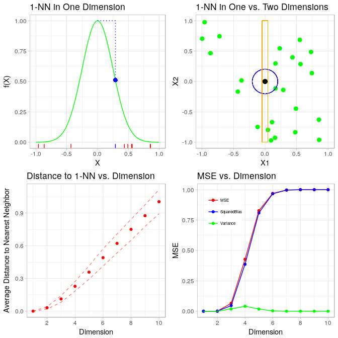
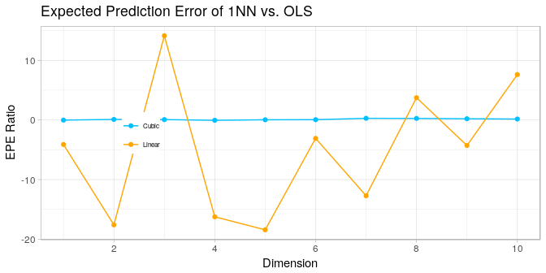
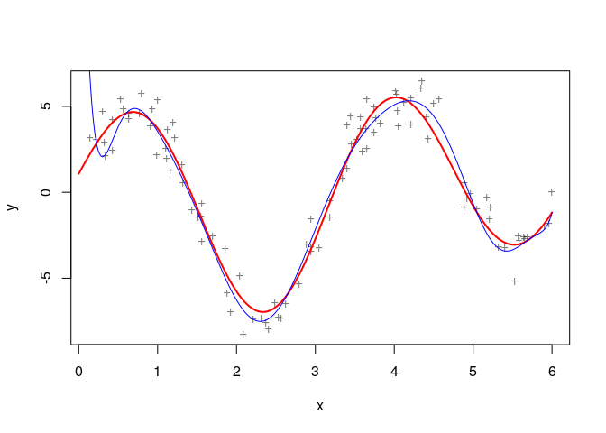
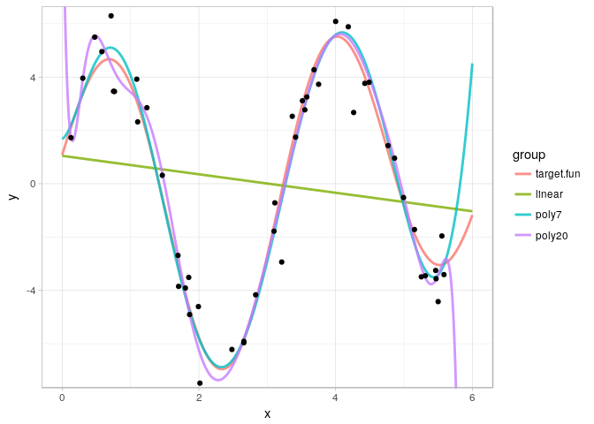
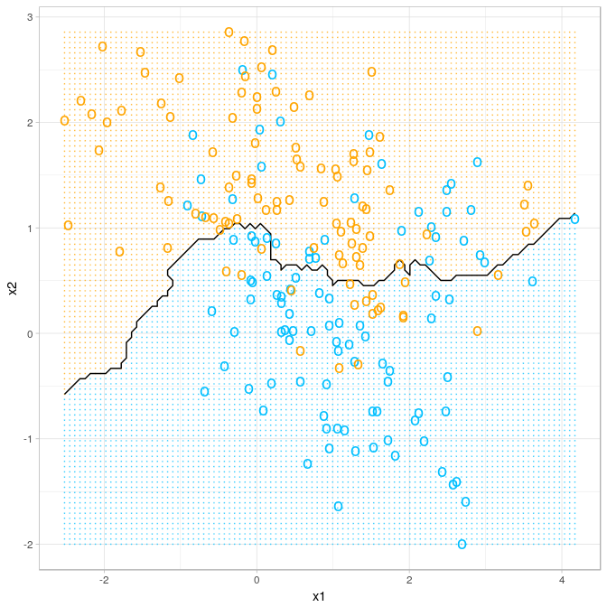

Chapter 2: Overview of Supervised Learning
================
Bodo Burger
2018-05

-   [Linear Model](#linear-model)
    -   [Figure 2-1 Classification using linear regression](#figure-2-1-classification-using-linear-regression)
-   [Nearest-Neighbors Method](#nearest-neighbors-method)
    -   [Figure 2-2 Classification using 15-nearest-neighbors](#figure-2-2-classification-using-15-nearest-neighbors)
    -   [Figure 2-3 Classification using 1-nearest-neighbor](#figure-2-3-classification-using-1-nearest-neighbor)
-   [Test error for k-nearest-neighbors](#test-error-for-k-nearest-neighbors)
    -   [Figure 2-4 Test error of nearest-neighbors for different k](#figure-2-4-test-error-of-nearest-neighbors-for-different-k)
-   [Local Methods in High Dimensions](#local-methods-in-high-dimensions)
    -   [Figure 2-6 Curse of dimensionality](#figure-2-6-curse-of-dimensionality)
    -   [Figure 2-7](#figure-2-7)
    -   [Figure 2-8](#figure-2-8)
    -   [Figure 2-9](#figure-2-9)
-   [Model Selection and the Bias-Variance Tradeoff](#model-selection-and-the-bias-variance-tradeoff)
    -   [Figure 2-11](#figure-2-11)
-   [Bonus figure: naive Bayes classifier](#bonus-figure-naive-bayes-classifier)
-   [Bonus figure: 67-nearest-neighbors](#bonus-figure-67-nearest-neighbors)
-   [Links](#links)

``` r
knitr::opts_chunk$set(echo = TRUE,
                      cache = TRUE,
                      cache.path = "cache/chapter02/",
                      message = FALSE,
                      fig.path = "figures/")
set.seed(123)
library("mlr")
library("ggplot2")
theme_set(theme_light())
```

Linear Model
============

The data is available from the ElemStatLearn package. We start by creating an MLR task and train a linear model to predict y.

``` r
me = ElemStatLearn::mixture.example
df = data.frame(x1 = me$x[,1], x2 = me$x[,2], y = me$y)
knitr::kable(df[sample(200, 4),], row.names = FALSE)
```

|          x1|         x2|    y|
|-----------:|----------:|----:|
|  -0.0771145|  0.5051217|    0|
|   3.1669716|  0.5569466|    1|
|   0.4708088|  0.0254386|    0|
|   1.9454294|  0.4810805|    1|

``` r
tsk = makeRegrTask(data = df, target = "y")
lrn.lm = makeLearner("regr.lm")
mod.lm = train(lrn.lm, tsk)
beta = coefficients(getLearnerModel(mod.lm))
knitr::kable(t(beta))
```

|  (Intercept)|         x1|         x2|
|------------:|----------:|----------:|
|    0.3290614|  -0.022636|  0.2495983|

We create a grid of points covering all realizations of *x*<sub>1</sub> and *x*<sub>2</sub> in the feature space. For each point we make a model prediction. We set the threshold for the classification to .5.

``` r
knitr::kable(summary(df[, c("x1", "x2")])[c(1,6), ], row.names = FALSE)
```

|       x1       |       x2       |
|:--------------:|:--------------:|
| Min. :-2.52082 | Min. :-1.99985 |
| Max. : 4.17075 | Max. : 2.85581 |

``` r
grid = expand.grid(x1 = seq(-2.6, 4.2, .1), x2 = seq(-2.0, 2.9, .05))
y.hat = getPredictionResponse(predict(mod.lm, newdata = grid))
grid["y.lm"] = factor(as.numeric(y.hat > .5))
```

The function for the decision boundary is determined by the estimated coefficients of the model.

``` r
db = function(x1, coef = beta) {
  (coef[3])^-1 * (0.5 - coef[1] - coef[2] * x1)
}
```

Figure 2-1 Classification using linear regression
-------------------------------------------------

``` r
ggplot() + 
  geom_point(aes(x = grid$x1, y = grid$x2, col = grid$y.lm), shape = 20, size = .05, alpha = .5, show.legend = FALSE) +
  geom_line(aes(x = grid$x1, y = db(grid$x1))) +
  geom_point(aes(x = df$x1, y = df$x2, col = factor(df$y)), shape = "o", size = 4, stroke = 2, show.legend = FALSE) +
  scale_colour_manual(values = c("deepskyblue", "orange")) +
  theme_void()
```


Nearest-Neighbors Method
========================

We start with a 15-nearest-neighbor model.

``` r
tsk2 = makeClassifTask(data = data.frame(df[,1:2], y = factor(df$y)), target = "y")
lrn.knn15 = makeLearner("classif.knn", k = 15)
mod.knn15 = train(lrn.knn15, tsk2)
```

``` r
Plot2DBinaryClassification = function(task, model, grid.res = 100) {
  data = getTaskData(task, target.extra = TRUE)
  x1 = data$data[, 1]
  x2 = data$data[, 2]
  grid = expand.grid(x1 = seq(min(x1), max(x1), length.out = grid.res), 
    x2 = seq(min(x2), max(x2), length.out = grid.res))
  y.hat = getPredictionResponse(predict(model, newdata = grid))
  ggplot() + 
    geom_point(aes(x = grid$x1, y = grid$x2, col = y.hat), shape = 20, size = .05, alpha = .5,
      show.legend = FALSE) +
    geom_contour(aes(grid$x1, grid$x2, z = as.numeric(y.hat)), col = "black", bins = 1) +
    geom_point(aes(x = x1, y = x2, col = data$target), shape = "o", size = 4, stroke = 2,
      show.legend = FALSE) +
    scale_colour_manual(values = c("deepskyblue", "orange")) +
    xlab(names(data$data)[1]) + ylab(names(data$data)[2])
}
```

Figure 2-2 Classification using 15-nearest-neighbors
----------------------------------------------------

``` r
Plot2DBinaryClassification(task = tsk2, model = mod.knn15) + theme_void()
```


Now we train a 1-nearest-neighbor model.

``` r
lrn.knn1 = setHyperPars(lrn.knn15, k = 1)
mod.knn1 = train(lrn.knn1, tsk2)
```

Figure 2-3 Classification using 1-nearest-neighbor
--------------------------------------------------

``` r
Plot2DBinaryClassification(task = tsk2, model = mod.knn1)
```


Test error for k-nearest-neighbors
==================================

Now we want to know the test error of the k-nearest-neighbor algorithm for different values of k. For reliable results we need more data. The book describes in detail how the data was simulated (also see documentation of mixture.example dataset).

``` r
means.indices = c(sample(1:10, 5000, replace = TRUE), sample(11:20, 5000, replace = TRUE))
X = me$means[means.indices, ] + mvtnorm::rmvnorm(10000, rep(0, 2), .2 * diag(2))
df.test = data.frame(x1 = X[ , 1], x2 = X[ , 2], y = c(rep(0, 5000), rep(1, 5000)))
knitr::kable(df.test[c(1, 10000), ]) # show first and last simulated point
```

|       |          x1|         x2|    y|
|-------|-----------:|----------:|----:|
| 1     |  -0.0101802|  0.3120567|    0|
| 10000 |  -0.9336943|  0.5191334|    1|

MLR makes tuning very convenient. We could use more advanced techniques to measure the test error but the book uses a simple holdout test set at this point with a very high test set split rate of .98 (200 training samples vs 10000 test samples).

``` r
df.full = rbind(df, df.test)
df.full$y = factor(df.full$y)
rin = makeFixedHoldoutInstance(train.inds = 1:200, test.inds = 201:10200, size = 10200) # defining a resampling instance
rin$desc$predict = "both"

tsk3 = makeClassifTask(data = df.full, target = "y")

k = c(1, 3, 5, 7, 9, 11, 15, 17, 23, 25, 35, 45, 55, 83, 101, 151)
ps = makeParamSet(makeDiscreteParam("k", k))
mmceTrainMean = setAggregation(mmce, train.mean)
models = tuneParams("classif.knn", tsk3, resampling = rin, par.set = ps,
                    measures = list(mmce, mmceTrainMean), control = makeTuneControlGrid())
results = generateHyperParsEffectData(models)
```

As a comparison we calculate the train / test error for the linear model, too.

``` r
y.hat = as.numeric(getPredictionResponse(predict(mod.lm, newdata = df.full)) > .5)
train.error.lm = 1 - mean(y.hat[1:200] ==  df$y)
test.error.lm = 1 - mean(y.hat[201:10200] ==  df.test$y)
```

Figure 2-4 Test error of nearest-neighbors for different k
----------------------------------------------------------

<!-- TODO -->
<!-- And bayes error rate. -->
<!-- performance(predict(mod.nb, newdata = df.full[201:10200, ])) -->
``` r
plot.data = data.frame(k, train = results$data$mmce.train.mean, test = results$data$mmce.test.mean)
plot.data = reshape2::melt(plot.data, id = "k")
ggplot(data = plot.data, aes(x = k, y = value, group = variable, col = variable)) +
  geom_line() + geom_point() +
  # linear model train and test error:
  geom_point(aes(x = 200/3, y = train.error.lm, col = "train"), shape = 15, size = 3) +
  geom_point(aes(x = 200/3, y = test.error.lm, col = "test"), shape = 15, size = 3) +
  # inversion and log trafo of x axis:
  scale_x_continuous(trans = scales::trans_new('nlog2_trans',
                                              transform = function(x) {-log2(x)},
                                              inverse = function(x) {2**(-x)},
                                              breaks = scales::log_breaks(20, 2))) +
  # visual tweaks:
  scale_color_manual(name = element_blank(), values = c("deepskyblue", "orange")) +
  ylab("Missclassification error") + theme(legend.position="bottom")
```


<!-- TODO -->
<!-- # Statistical Decision Theory -->
<!-- *Check solutions for Exercise 2.2.* -->
<!-- ## Figure 2-5 optimal Bayes decision boundary -->
<!-- ```{r figure-2-5-optimal-bayes, fig.asp=1} -->
<!-- ``` -->
Local Methods in High Dimensions
================================

``` r
e = function(r, p = 1) r^(1/p)
x = seq(0, .6, .001)
p = c(1, 2, 3, 10)
curse.data = data.frame(r = rep(x, length(p)), p = sort(rep(p, length(x))))
curse.data['Distance'] = unlist(Map(e, curse.data$r, curse.data$p))
```

Figure 2-6 Curse of dimensionality
----------------------------------

``` r
ggplot(curse.data, aes(x = r, y = Distance, group = p)) + geom_line(col = "aquamarine3", size = .6) +
  xlab("Fraction of Volume") + xlim(c(0, .65)) + scale_y_continuous(breaks=seq(0, 1, 0.2)) +
  directlabels::geom_dl(aes(label = paste0(" p = ", as.character(p))), method = "last.points") +
  geom_vline(data = data.frame(x = c(.1, .3)), aes(xintercept = x), linetype = "dashed", col = "deepskyblue", alpha = .5)
```


For the following figure we simulate the uniformly distributed data over 10 dimensions.

``` r
simulateData = function(p = 10, n = 1000) replicate(p, runif(n, -1, 1))

target.fun = function(x) exp(-8 * norm(matrix(x, ncol = 1))^2)
p = 10 # number of dimensions
n = 1000 # sample size
set.seed(234)
multi.dim.data = simulateData(p, n) # creating n samples from p dimensions

# top-left panel:
d1.10 = multi.dim.data[1:10 ,1] # we only look at 10 obs of one dimension
nn0 = d1.10[which.min(abs(d1.10))] # looking for the "nearest-neighbor" of zero
path.data = data.frame(x = c(0, nn0, nn0), y = sapply(c(0, 0, nn0), target.fun))
grid.tl = seq(-1, 1, .01)

# top-right panel:
d1 = multi.dim.data[1:24, 1] # first dimension
d2 = multi.dim.data[1:24, 2] # second dimension
nn1 = d1[which.min(abs(d1))] # "nearest-neighbor" of zero in one dimension
dist0 = sqrt(d1^2 + d2^2) # euclidean distance between all points and (0, 0)
i.min = which.min(dist0) # index of "nearest-neighbor"
nn2 = c(d1[i.min], d2[i.min])

# bottom-left panel:
obs = 1:10
example.2d = data.frame(n = obs, x1 = d1[obs], x2 = d2[obs])
distances = as.matrix(dist(example.2d[-1], upper = TRUE, diag = TRUE))
tmp = apply(distances + diag(Inf, 10), 1, which.min)
tmp2 = apply(distances + diag(Inf, 10), 1, min)
ggplot(data = example.2d, mapping = aes(x = x1, y = x2)) + 
  ggforce::geom_circle(data = example.2d, aes(x0 = x1, y0 = x2, r = tmp2), 
                       col = "green", alpha = .1, inherit.aes = FALSE) +
  geom_text(aes(label = n), size = 6) +
  geom_text(aes(y = x2 - .15, label = paste0("NN: ",tmp, "\nDist: ",round(tmp2, 2))), 
            col = "red", size = 3) +
  ggtitle("Nearest neighbor for 10 observations and two dimensions")
```


``` r
bl.data = data.frame(Dimension = 1:p, AverageDistance = rep(0, p), 
                     Distance1q = rep(0, p), Distance3q = rep(0, p))
for (d in 1:p) {
  #cat("Dimension", d, "\n")
  distances = as.matrix(dist(multi.dim.data[ ,1:d], upper = TRUE, diag = TRUE))
  min.distances = apply(distances + diag(Inf, n), 1, min)
  # min.distances equals distance to nearest neighbor
  bl.data[d, "AverageDistance"] = mean(min.distances)
  bl.data[d, "Distance1q"] = quantile(min.distances)[2]
  bl.data[d, "Distance3q"] = quantile(min.distances)[4]
}

# bottom-right panel:
B = 500
y0.hat.matrix = matrix(nrow = p, ncol = B)
for (b in 1:B) {
  X = simulateData(p = 10, n = 1000)
  for (d in 1:p) {
    Xd = X[ , 1:d, drop = FALSE]
    nn = Xd[which.min(rowSums(Xd^2)), ] # looking for the nearest-neighbor for x = (0, ..., 0) 
    y0.hat = target.fun(nn) # 1-nn-prediction for target value of x = (0, ..., 0)
    y0.hat.matrix[d, b] = y0.hat
  }
}
bias.matrix = y0.hat.matrix - 1 # target.fun(zero) = 1 for any dimension
y0.hat.bias = rowMeans(bias.matrix)
y0.hat.var = apply(y0.hat.matrix, 1, var)
y0.hat.mse = y0.hat.var + y0.hat.bias^2
br.data = data.frame(Dimension = rep(1:10, 3),
                     grp = c(rep("MSE", 10), rep("Variance", 10), rep("SquaredBias", 10)),
                     value = c(y0.hat.mse, y0.hat.var, y0.hat.bias^2))

# using mlr; this takes much longer because we fit B * p models
# B = 500
# lrn.knn1.regr = makeLearner("regr.kknn", k = 1)
# x0 = data.frame(matrix(0, nrow = 1, ncol = p))
# y0.hat.matrix = matrix(nrow = p, ncol = B)
# for (b in 1:B) {
#   cat("Round ", b, "/", B, "\n")
#   X = simulateData(p = 10, n = 1000)
#   for (d in 1:p) {
#     Xd = X[ , 1:d, drop = FALSE]
#     target = apply(Xd, 1, target.fun)
#     df = data.frame(Xd, target)
#     x = x0[1:d]
#     if(d == 1) names(x) = "Xd" # weird work around because of R behaviour naming columns
#     tsk4 = makeRegrTask(data = df, target = "target")
#     trn = train(lrn.knn1.regr, tsk4)
#     y0.hat = getPredictionResponse(predict(trn, newdata = x))
#     y0.hat.matrix[d, b] = y0.hat
#   }
# }
```

The bias-variance decomposition panel is the most complicated. We have to calculate the expected value of the target value for **x** = (0, …, 0) predicted by 1-nearest-neighbor given a sample of *n = 1000* observations. We estimate the expected value by drawing 500 samples with 1000 observations, calculating the target value of the nearest neighbor to zero and the empirical mean of these predictions.

Figure 2-7
----------

``` r
tl = ggplot(data.frame(x = grid.tl, y = sapply(grid.tl, target.fun)), aes(x, y)) +
  geom_line(col = "green") +
  geom_rug(data = data.frame(x = d1.10, grp = factor(nn0 == d1.10)), aes(x = x, y = NULL, col = grp),
           show.legend = FALSE) + scale_color_manual(values = c("red", "blue")) +
  geom_path(data = path.data, aes(x = x, y = y), linetype = "dotted", col = "blue") +
  geom_point(mapping = aes(x = nn0, y = target.fun(nn0)), col = "blue", size = 2) +
  xlab("X") + ylab("f(X)") + ggtitle("1-NN in One Dimension")

tr = ggplot(data.frame(d1, d2), aes(x = d1, y = d2)) +
  geom_point(col = "green", size = 2.5) +
  ggforce::geom_circle(data = NULL, aes(x0 = 0, y0 = 0, r = min(dist0)), inherit.aes = FALSE,
                       colour = "blue", size = .2) +
  geom_rect(aes(xmin = -abs(nn1), xmax = abs(nn1), ymin = -1, ymax = 1),
            colour = "orange", alpha = 0, size = .2) +
  geom_point(data = NULL, aes(x = 0, y = 0), size = 2.5) +
  xlim(c(-1,1)) + xlab("X1") + ylab("X2") + ggtitle("1-NN in One vs. Two Dimensions")

bl = ggplot(bl.data, aes(x = Dimension, y = AverageDistance)) +
  geom_point(col = "red") +
  geom_line(aes(y = Distance1q), col = "red", alpha = .5, linetype = 2) + 
  geom_line(aes(y = Distance3q), col = "red", alpha = .5, linetype = 2) +
  xlab("Dimension") + ylab("Average Distance to Nearest Neighbor") +
  scale_x_continuous(breaks = seq(2,p,2)) +
  ggtitle("Distance to 1-NN vs. Dimension")

br = ggplot(data = br.data, mapping = aes(x = Dimension, y = value, group = grp, colour = grp)) +
  geom_point() + geom_line() +
  scale_colour_manual(values = c("red", "blue", "green")) +
  scale_x_continuous(breaks = seq(2,p,2)) + ylab("MSE") + 
  theme(legend.title = element_blank(), legend.position = c(.2, .8),
        legend.text = element_text(size = 6), legend.margin = margin(t=0,r=0,b=0,l=0)) +
  ggtitle("MSE vs. Dimension")

gridExtra::grid.arrange(tl, tr, bl, br, nrow = 2, ncol = 2)
```



It would be interesting to know why squared bias and MSE in the bottom-right panel deviate quite a lot from the book. I have no answer to that at the moment.

For Figure 2-8 the target function is constant in all but one dimension.

``` r
target.fun = function(x) .5 * (matrix(x[1], ncol = 1) + 1)^3

# left panel:
nn0 = d1.10[which.min(abs(d1.10))] # looking for the "nearest-neighbor" of zero
path.data = data.frame(x = c(0, nn0, nn0), y = sapply(c(0, 0, nn0), target.fun))

# right panel:
B = 10000
y0.hat.matrix = matrix(nrow = p, ncol = B)
for (b in 1:B) {
  X = simulateData(p = 10, n = 1000)
  for (d in 1:p) {
    Xd = X[ , 1:d, drop = FALSE]
    nn = Xd[which.min(rowSums(Xd^2)), ] # looking for the nearest-neighbor for x = (0, ..., 0) 
    y0.hat = target.fun(nn) # 1-nn-prediction for target value of x = (0, ..., 0)
    y0.hat.matrix[d, b] = y0.hat
  }
}
bias.matrix = y0.hat.matrix - .5 # target.fun(zero) = .5 for any dimension
y0.hat.bias = rowMeans(bias.matrix)
y0.hat.var = apply(y0.hat.matrix, 1, var)
y0.hat.mse = y0.hat.var + y0.hat.bias^2
rp.data = data.frame(Dimension = rep(1:10, 3),
                     grp = c(rep("MSE", 10), rep("Variance", 10), rep("SquaredBias", 10)),
                     value = c(y0.hat.mse, y0.hat.var, y0.hat.bias^2))
```

Figure 2-8
----------

``` r
lp = ggplot(data.frame(x = grid.tl, y = sapply(grid.tl, target.fun)), aes(x, y)) +
  geom_line(col = "deepskyblue") +
  geom_rug(data = data.frame(x = d1.10, grp = factor(nn0 == d1.10)), aes(x = x, y = NULL, col = grp),
           show.legend = FALSE) + scale_color_manual(values = c("orange", "aquamarine3")) +
  geom_path(data = path.data, aes(x = x, y = y), linetype = "dotted", col = "aquamarine3") +
  geom_point(mapping = aes(x = nn0, y = target.fun(nn0)), col = "aquamarine3", size = 2) +
  xlab("X") + ylab("f(X)") + ggtitle("1-NN in One Dimension")

rp = ggplot(data = rp.data, mapping = aes(x = Dimension, y = value, group = grp, colour = grp)) +
  geom_point() + geom_line() +
  scale_colour_manual(values = c("orange", "aquamarine3", "deepskyblue")) +
  scale_x_continuous(breaks = seq(2,p,2)) + ylab("MSE") + 
  theme(legend.title = element_blank(), legend.position = c(.2, .8),
        legend.text = element_text(size = 6), legend.margin = margin(t=0,r=0,b=0,l=0)) +
  ggtitle("MSE vs. Dimension")

gridExtra::grid.arrange(lp, rp, nrow = 1)
```


Figure 2-9
----------

``` r
p = 10
n = 500
simulateData = function(p = 10, n = 500) replicate(p, runif(n, -1, 1))
target.orange = function(x) x[1] + rnorm(1)
target.blue = function(x) .5 * (x[1] + 1)^3 + rnorm(1)

B = 1000
nn.y0.hat.matrix.orange = matrix(nrow = p, ncol = B)
nn.y0.hat.matrix.blue = matrix(nrow = p, ncol = B)
ls.y0.hat.orange = numeric(B)
ls.y0.hat.blue = numeric(B)
for (b in 1:B) {
  X = simulateData()
  x1 = X[ , 1]
  y.orange = sapply(x1, target.orange)
  y.blue = sapply(x1, target.blue)
  fit.lm.orange = lm(y.orange ~ x1) # with or without intercept?
  fit.lm.blue = lm(y.blue ~ x1)
  ls.y0.hat.orange[b] = predict(fit.lm.orange, newdata = data.frame(x1 = 0))
  ls.y0.hat.blue[b] = predict(fit.lm.blue, newdata = data.frame(x1 = 0))
  for (d in 1:p) {
    Xd = X[ , 1:d, drop = FALSE]
    nn = Xd[which.min(rowSums(Xd^2)), ] # looking for the nearest-neighbor for x = (0, ..., 0) 
    y0.hat.orange = target.orange(nn) # 1-nn-prediction for target value of x = (0, ..., 0)
    y0.hat.blue = target.blue(nn) # 1-nn-prediction for target value of x = (0, ..., 0)
    nn.y0.hat.matrix.orange[d, b] = y0.hat.orange
    nn.y0.hat.matrix.blue[d, b] = y0.hat.blue
  }
}
nn.bias.matrix.orange = nn.y0.hat.matrix.orange # target.orange(zero) = 0 for any dimension
nn.bias.matrix.blue = nn.y0.hat.matrix.blue - .5 # target.blue(zero) = 0.5 for any dimension
nn.y0.hat.bias.orange = rowMeans(nn.bias.matrix.orange)
nn.y0.hat.bias.blue = rowMeans(nn.bias.matrix.blue)
ls.y0.hat.bias.orange = mean(ls.y0.hat.orange)
ls.y0.hat.bias.blue = mean(ls.y0.hat.blue - .5)
p.data = data.frame(Dimension = rep(1:10, 2),
                    grp = c(rep("Linear", 10), rep("Cubic", 10)),
                    value = c(nn.y0.hat.bias.orange/ls.y0.hat.bias.orange,
                              nn.y0.hat.bias.blue/ls.y0.hat.bias.blue))
```

Obviously, figure 2-9 is off. Find the mistake! ;)

``` r
ggplot(data = p.data, mapping = aes(x = Dimension, y = value, group = grp, colour = grp)) +
  geom_point() + geom_line() +
  scale_colour_manual(values = c("deepskyblue", "orange")) +
  scale_x_continuous(breaks = seq(2,p,2)) + ylab("EPE Ratio") + 
  theme(legend.title = element_blank(), legend.position = c(.2, .5),
        legend.text = element_text(size = 6), legend.margin = margin(t=0,r=0,b=0,l=0)) +
  ggtitle("Expected Prediction Error of 1NN vs. OLS")
```



Model Selection and the Bias-Variance Tradeoff
==============================================

Figure 2-11 is reproduced by an actual example.

``` r
# data generating process
n = 100
target.fun = function(x) 5 * sin(2 * x) + 2 * cos(x + 1)
x = runif(n, 0, 6)
eps = rnorm(n, 0, 1)
y = target.fun(x) + eps

# train / test set split
ratio = .5
train.indices = c(rep(TRUE, ratio * n), rep(FALSE, (1 - ratio) * n))
train.df = data.frame(x = x[train.indices], y = y[train.indices])
test.df = data.frame(x = x[!train.indices], y = y[!train.indices])

#
grid.x = data.frame(x = seq(0, 6, .01))
plot(x, y, pch = "+", col = rgb(0, 0, 0, alpha = .5))
lines(grid.x$x, target.fun(grid.x$x), col = "red", lwd = 2)
test.fit = lm(y ~ poly(x, 12, raw = TRUE), data = train.df)
lines(grid.x$x, predict(object = test.fit, newdata = data.frame(x = grid.x$x)), col = "blue")
```



``` r
#
B = 1000
mse = function(y, y.hat) mean((y - y.hat)^2)
k = 12
train.errors = matrix(nrow = k, ncol = B)
test.errors = matrix(nrow = k, ncol = B)
for (b in (1:B)) {
  x = runif(n, 0, 6)
  eps = rnorm(n, 0, 1)
  y = target.fun(x) + eps
  train.df = data.frame(x = x[train.indices], y = y[train.indices])
  test.df = data.frame(x = x[!train.indices], y = y[!train.indices])
  for (i in (1:k)) {
    fit = lm(y ~ poly(x, i, raw = TRUE), data = train.df)
    train.errors[i, b] = mse(train.df$y, predict(fit))
    test.errors[i, b] = mse(test.df$y, predict(fit, newdata = test.df))
  }
}
p.data = data.frame(k = rep(1:k, 2), error = c(rowMeans(train.errors), rowMeans(test.errors)), 
                    grp = c(rep("train", k), rep("test", k)))
```

Figure 2-11
-----------

``` r
ggplot(data = p.data, mapping = aes(x = factor(k), y = error, group = grp, color = grp)) +
  geom_point(size = 2) + geom_line(alpha = .2) + coord_cartesian(ylim = c(0, 30)) +
  xlab("Model Complexity") + ylab("Prediction Error") + 
  theme(legend.title = element_blank(), legend.position = c(.5, .7))
```


Polynomial of degree 7 seems to be the sweet spot.

``` r
fit1 = lm(y ~ poly(x, 1, raw = TRUE), data = train.df)
fit7 = lm(y ~ poly(x, 7, raw = TRUE), data = train.df)
fit20 = lm(y ~ poly(x, 20, raw = TRUE), data = train.df)

p2.data = data.frame(x = grid.x$x, 
                     target.fun = target.fun(grid.x$x),
                     linear = predict(fit1, newdata = grid.x),
                     poly7 = predict(fit7, newdata = grid.x),
                     poly20 = predict(fit20, newdata = grid.x))
```

    ## Warning in predict.lm(fit20, newdata = grid.x): prediction from a rank-
    ## deficient fit may be misleading

``` r
p2.data = reshape2::melt(p2.data, id = "x", variable.name = "group", value.name = "y")
ggplot(data = p2.data, mapping = aes(x = x, y = y, group = group, col = group)) +
  geom_line(size = 1, alpha = .8) + geom_point(data = train.df, mapping = aes(x = x, y = y), inherit.aes = FALSE) +
  coord_cartesian(ylim = c(-7, 6))
```



Bonus figure: naive Bayes classifier
====================================

``` r
lrn.nb = makeLearner("classif.naiveBayes")
mod.nb = train(lrn.nb, tsk2)
Plot2DBinaryClassification(tsk2, mod.nb)
```


Bonus figure: 67-nearest-neighbors
==================================

The degrees of freedom for k-nearest-neighbors is given by $\\frac{n}{k}$.

``` r
lrn.knn67 = setHyperPars(lrn.knn15, k = 67)
mod.knn67 = train(lrn.knn67, tsk2)
Plot2DBinaryClassification(tsk2, mod.knn67)
```



Links
=====

-   R documentation of mixture.example data `?ElemStatLearn::mixture.example`
-   <https://stackoverflow.com/questions/39822505/drawing-decision-boundaries-in-r>
-   <https://stats.stackexchange.com/questions/21572/how-to-plot-decision-boundary-of-a-k-nearest-neighbor-classifier-from-elements-o>
-   <https://stackoverflow.com/questions/11053899/how-to-get-a-reversed-log10-scale-in-ggplot2>
