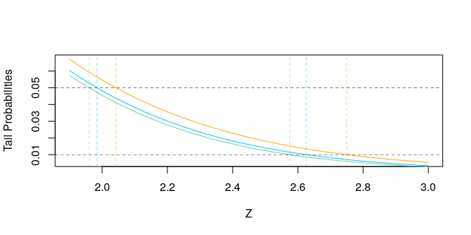

Chapter 3: Linear Methods for Regression
================
Bodo Burger
2018-05

-   [Linear Regression Models](#linear-regression-models)
    -   [Figure 3-3 tail probabilities](#figure-3-3-tail-probabilities)
    -   [Table 3-1](#table-3-1)
    -   [Table 3-2](#table-3-2)
-   [Links](#links)

``` r
knitr::opts_chunk$set(echo = TRUE, message = FALSE,
                      cache = TRUE, cache.path = "cache/",
                      fig.path = "figures/")
set.seed(123)
library("mlr")
library("ggplot2")
theme_set(theme_light())
```

Linear Regression Models
========================

Figure 3-3 tail probabilities
-----------------------------

``` r
z = seq(1.9, 3, .01)
plot(z, 2 * (1 - pt(z, df = 30)), col = "orange", type = "l", lwd = 1, xlab = "Z", ylab = "Tail Probabilities")
lines(z, 2 * (1 - pt(z, df = 100)), col = "deepskyblue")
lines(z, 2 * (1 - pnorm(z)), col = "aquamarine3")
abline(h = c(.01, .05), lty = 2, lwd = .5)
abline(v = qt(c(.975, .995), df = 30), lty = 2, lwd = .5, col = "orange")
abline(v = qt(c(.975, .995), df = 100), lty = 2, lwd = .5, col = "deepskyblue")
abline(v = qnorm(c(.975, .995)), lty = 2, lwd = .5, col = "aquamarine3")
```



Table 3-1
---------

``` r
prostate.data = ElemStatLearn::prostate
#prostate.data$svi = factor(prostate.data$svi)
#prostate.data$gleason = factor(prostate.data$gleason, ordered = TRUE)
prostate.cor = round(cor(subset(prostate.data, subset = train, select = 1:8)), digits = 3)
prostate.cor[upper.tri(prostate.cor, diag = "TRUE")] = ""
knitr::kable(prostate.cor[-1, -8])
```

|         | lcavol | lweight | age   | lbph   | svi   | lcp   | gleason |
|---------|:-------|:--------|:------|:-------|:------|:------|:--------|
| lweight | 0.3    |         |       |        |       |       |         |
| age     | 0.286  | 0.317   |       |        |       |       |         |
| lbph    | 0.063  | 0.437   | 0.287 |        |       |       |         |
| svi     | 0.593  | 0.181   | 0.129 | -0.139 |       |       |         |
| lcp     | 0.692  | 0.157   | 0.173 | -0.089 | 0.671 |       |         |
| gleason | 0.426  | 0.024   | 0.366 | 0.033  | 0.307 | 0.476 |         |
| pgg45   | 0.483  | 0.074   | 0.276 | -0.03  | 0.481 | 0.663 | 0.757   |

Table 3-2
---------

``` r
train.data = subset(prostate.data, subset = train, select = 1:9)
# predictors need to be standardized
lm.fit = lm(lpsa ~ ., data = train.data)
```

Links
=====
