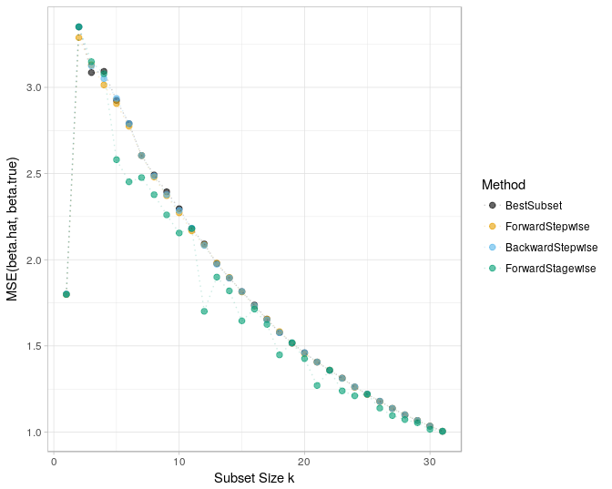

Chapter 3: Linear Methods for Regression
================
Bodo Burger
2018-05

-   [Linear Regression Models](#linear-regression-models)
    -   [Figure 3-3 tail probabilities](#figure-3-3-tail-probabilities)
    -   [Table 3-1](#table-3-1)
    -   [Table 3-2](#table-3-2)
-   [Subset Selection](#subset-selection)
    -   [Figure 3-5 all subset models for prostate cancer example](#figure-3-5-all-subset-models-for-prostate-cancer-example)
    -   [Figure 3-6 comparison of subset techniques](#figure-3-6-comparison-of-subset-techniques)
-   [Links](#links)

``` r
knitr::opts_chunk$set(echo = TRUE, message = FALSE,
                      cache = TRUE, cache.path = "cache/chapter03/",
                      fig.path = "figures/")
set.seed(123)
library("mlr")
library("ggplot2")
theme_set(theme_light())
cbbPalette = c("#000000", "#E69F00", "#56B4E9", "#009E73", "#F0E442", "#0072B2", "#D55E00", "#CC79A7")
```

Linear Regression Models
========================

Figure 3-3 tail probabilities
-----------------------------

``` r
z = seq(1.9, 3, .01)
plot(z, 2 * (1 - pt(z, df = 30)), col = "orange", type = "l", lwd = 1, xlab = "Z", ylab = "Tail Probabilities")
lines(z, 2 * (1 - pt(z, df = 100)), col = "deepskyblue")
lines(z, 2 * (1 - pnorm(z)), col = "aquamarine3")
abline(h = c(.01, .05), lty = 2, lwd = .5)
abline(v = qt(c(.975, .995), df = 30), lty = 2, lwd = .5, col = "orange")
abline(v = qt(c(.975, .995), df = 100), lty = 2, lwd = .5, col = "deepskyblue")
abline(v = qnorm(c(.975, .995)), lty = 2, lwd = .5, col = "aquamarine3")
```


Table 3-1
---------

``` r
prostate.data = ElemStatLearn::prostate
prostate.cor = round(cor(subset(prostate.data, subset = train, select = 1:8)), digits = 3)
prostate.cor[upper.tri(prostate.cor, diag = "TRUE")] = ""
knitr::kable(prostate.cor[-1, -8])
```

|         | lcavol | lweight | age   | lbph   | svi   | lcp   | gleason |
|---------|:-------|:--------|:------|:-------|:------|:------|:--------|
| lweight | 0.3    |         |       |        |       |       |         |
| age     | 0.286  | 0.317   |       |        |       |       |         |
| lbph    | 0.063  | 0.437   | 0.287 |        |       |       |         |
| svi     | 0.593  | 0.181   | 0.129 | -0.139 |       |       |         |
| lcp     | 0.692  | 0.157   | 0.173 | -0.089 | 0.671 |       |         |
| gleason | 0.426  | 0.024   | 0.366 | 0.033  | 0.307 | 0.476 |         |
| pgg45   | 0.483  | 0.074   | 0.276 | -0.03  | 0.481 | 0.663 | 0.757   |

Table 3-2
---------

``` r
#prostate.data$svi = factor(prostate.data$svi) 
#prostate.data$gleason = factor(prostate.data$gleason, ordered = TRUE)
#numerical.features = c("lcavol", "lweight", "age", "lbph", "lcp", "pgg45")
prostate.data[-c(9, 10)] = scale(prostate.data[-c(9, 10)])
train.data = subset(prostate.data, subset = train, select = 1:9)
test.data = subset(prostate.data, subset = !train, select = 1:9)
lm.model = lm(lpsa ~ ., data = train.data)
knitr::kable(summary(lm.model)$coefficients[, -4], digits = 2)
```

|             |  Estimate|  Std. Error|  t value|
|-------------|---------:|-----------:|--------:|
| (Intercept) |      2.46|        0.09|    27.60|
| lcavol      |      0.68|        0.13|     5.37|
| lweight     |      0.26|        0.10|     2.75|
| age         |     -0.14|        0.10|    -1.40|
| lbph        |      0.21|        0.10|     2.06|
| svi         |      0.31|        0.12|     2.47|
| lcp         |     -0.29|        0.15|    -1.87|
| gleason     |     -0.02|        0.15|    -0.15|
| pgg45       |      0.27|        0.15|     1.74|

To reproduce exactly the results from the book we need to standardize all predictor variables. Note that we also standardize **svi** (a factor / dummy variable) and **gleason** (a ordered categorical variable) which seems odd but is suggested for the regularization method that is used below (see [Tibshirani (1997) The LASSO method](http://statweb.stanford.edu/~tibs/lasso/fulltext.pdf)).

Subset Selection
================

The dataset has 8 features. The number of combination for subset size k is $\\binom{8}{k}$; for *k* = 4 we reach the maximum number of combinations $\\binom{8}{4} = 70$, so if we set `nbest = 70` we store each possible combination of the feature set.

``` r
leaps.model = leaps::regsubsets(lpsa ~ ., data = train.data, nbest = 70, really.big = TRUE)
prostate.models = summary(leaps.model)$which
prostate.models.size = as.numeric(attr(prostate.models, "dimnames")[[1]])
prostate.models.rss = summary(leaps.model)$rss
prostate.models.best.rss = tapply(prostate.models.rss, prostate.models.size, min)
prostate.intercept.model = lm(lpsa ~ 1, data = train.data)
prostate.models.best.rss = c(sum(residuals(prostate.intercept.model)^2), prostate.models.best.rss)
```

Figure 3-5 all subset models for prostate cancer example
--------------------------------------------------------

``` r
ggplot(mapping = aes(x = 0:8, y = prostate.models.best.rss)) +
  geom_point(mapping = aes(x = prostate.models.size, y = prostate.models.rss), col = "slategray") + 
  geom_point(col = "red", size = 2) + geom_line(col = "red") +
  coord_cartesian(ylim = c(0, 100)) + xlab("Subset Size k") + ylab("Residual Sum-of-Squares")
```


The data generating process for Figure 3.6 is described in its subtitle in the book. The estimates are are averaged over several simulations.

``` r
n = 300 # number of observations
p = 31 # number of features
generateData = function(n, p) { # data generating process
  # features X:
  mu = rep(0, p)
  sigma = matrix(.85, ncol = p, nrow = p) + diag(.15, p)
  X = mvtnorm::rmvnorm(n, mean = mu, sigma = sigma)
  # coefficients b:
  b = numeric(p)
  non.zero = sort(sample(p, 10)) # indices of non-zero coefficients
  b[non.zero] = rnorm(10, 0, .4)
  # noise eps:
  eps = rnorm(n, 0, 6.25)
  # target y:
  y = X %*% b + eps
  # data.frame
  df = data.frame(y, X)
  return(list(data = df, y = y, X = X, b = b, eps = eps, non.zero = non.zero))
}
K = 20 # number of simulations
bestsub.mse.matrix = matrix(numeric(1), nrow = K, ncol = p)
forstep.mse.matrix = matrix(numeric(1), nrow = K, ncol = p)
backstep.mse.matrix = matrix(numeric(1), nrow = K, ncol = p)
forstage.mse.matrix = matrix(numeric(1), nrow = K, ncol = p)
set.seed(1990)

for (k in 1:K) {
  #cat("# Sim", k, "/", K, "#")
  dgp = generateData(n, p)
  b = dgp$b
  names(b) = paste0("X", 1:31)
  
  bestsub.model = leaps::regsubsets(y ~ ., data = dgp$data, nbest = 1, nvmax = 300540195,
    intercept = FALSE, method = "exhaustive", really.big = TRUE)
  forstep.model = leaps::regsubsets(y ~ ., data = dgp$data, nbest = 1, nvmax = 31,
    intercept = FALSE, method = "forward")
  backstep.model = leaps::regsubsets(y ~ ., data = dgp$data, nbest = 1, nvmax = 31,
    intercept = FALSE, method = "backward")
  forstage.model = leaps::regsubsets(y ~ ., data = dgp$data, nbest = 1, nvmax = 31,
    intercept = FALSE, method = "seqrep")
  
  for (i in 1:p) {
    bestsub.hat = coef(bestsub.model, i)
    bestsub.true = b[names(bestsub.hat)]
    bestsub.mse.matrix[k, i] = mean((bestsub.hat - bestsub.true)^2)
    forstep.hat = coef(forstep.model, i)
    forstep.true = b[names(forstep.hat)]
    forstep.mse.matrix[k, i] = mean((forstep.hat - forstep.true)^2)
    backstep.hat = coef(backstep.model, i)
    backstep.true = b[names(backstep.hat)]
    backstep.mse.matrix[k, i] = mean((backstep.hat - backstep.true)^2)
    forstage.hat = coef(forstage.model, i)
    forstage.true = b[names(forstage.hat)]
    forstage.mse.matrix[k, i] = mean((forstage.hat - forstage.true)^2)
  }
}
```

Figure 3-6 comparison of subset techniques
------------------------------------------

``` r
df.plot = data.frame(k = 1:31,
  BestSubset = colMeans(bestsub.mse.matrix),
  ForwardStepwise = colMeans(forstep.mse.matrix),
  BackwardStepwise = colMeans(backstep.mse.matrix),
  ForwardStagewise = colMeans(forstage.mse.matrix))
df.plot = reshape2::melt(df.plot, id.vars = "k", variable.name = "Method", value.name = "MSE")
ggplot(data = df.plot, mapping = aes(x = k, y = MSE, color = Method)) +
  geom_point(alpha = .6, size = 2) + geom_line(linetype = "dotted", alpha = .2) +
  scale_colour_manual(values=cbbPalette) + xlab("Subset Size k") + ylab("MSE(beta.hat, beta.true)")
```



According to the book the plot should show the "mean-squared error of the estimated coefficient *β*<sub>*k*</sub> at each step from the true *β*", but the results are not reproduced here. I do not know yet where my approach differs.

Links
=====
