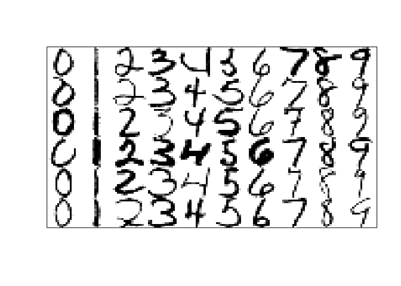
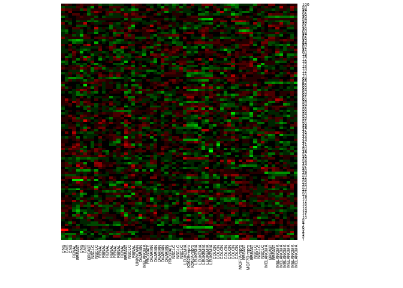

Chapter 1: Introduction
================
Bodo Burger

Examples of learning problems
=============================

Table 1.1. Spam data
--------------------

*skipped for now*

Figure 1.1. Scatterplot matrix of prostate cancer data
------------------------------------------------------

``` r
df.prostate = ElemStatLearn::prostate

pairs(df.prostate[, c("lpsa", "lcavol", "lweight", "age", "lbph", "svi", "lcp", "gleason", "pgg45")],
      col = "blueviolet", cex = .5, cex.axis = .5)
```


Figure 1.2. Examples of handwritten digits from U.S. postal envelopes
---------------------------------------------------------------------



Figure 1.3. DNA microarray data
-------------------------------

The data is from the NCI60 cancer microarray project (<http://genome-www.stanford.edu/nci60>).

``` r
df.nci = ElemStatLearn::nci
heatmap(df.nci[sample(nrow(df.nci), 100), ], Colv = NA, Rowv = NA, scale = "row",
        cexRow = .5, cexCol = .5, col = colorRampPalette(rev(c("green", "black", "red")))(15))
```



There are no grey cells representing missing values because these have already imputed and the names of the genes (rows) are not available.
