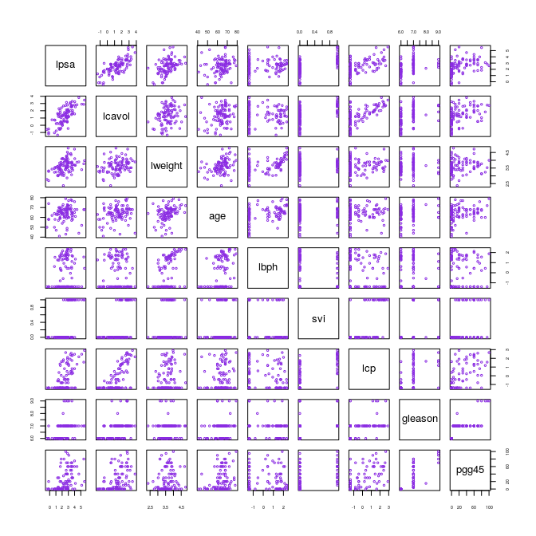

Chapter 1: Introduction
================
Bodo Burger

Example 1: Email Spam
=====================

Table 1.1
---------

*skipped for now*

Example 2: Prostate Cancer
==========================

Figure 1.1 Scatterplot matrix of prostate cancer data
-----------------------------------------------------

``` r
df = ElemStatLearn::prostate

pairs(df[, c("lpsa", "lcavol", "lweight", "age", "lbph", "svi", "lcp", "gleason", "pgg45")],
      col = "blueviolet", cex = .5, cex.axis = .5)
```


