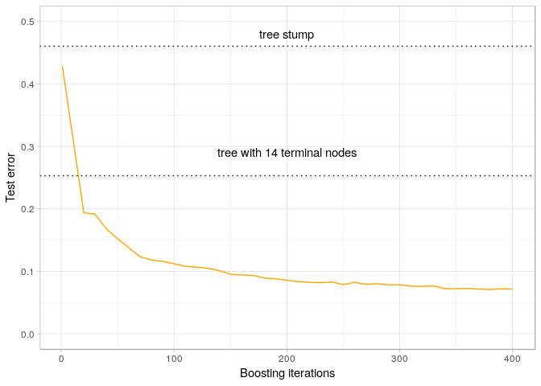
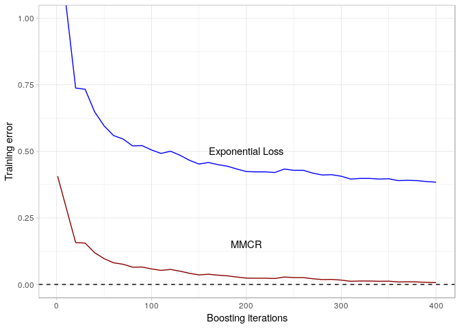
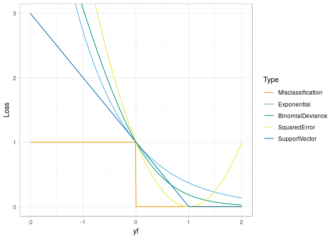
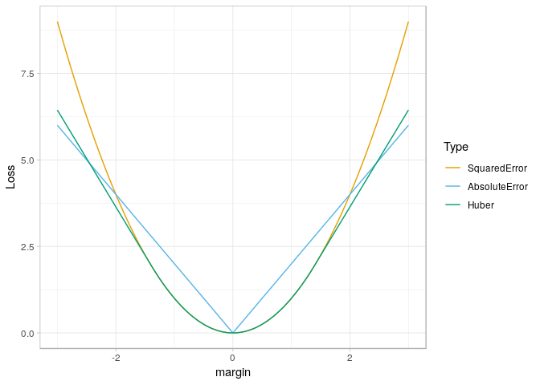
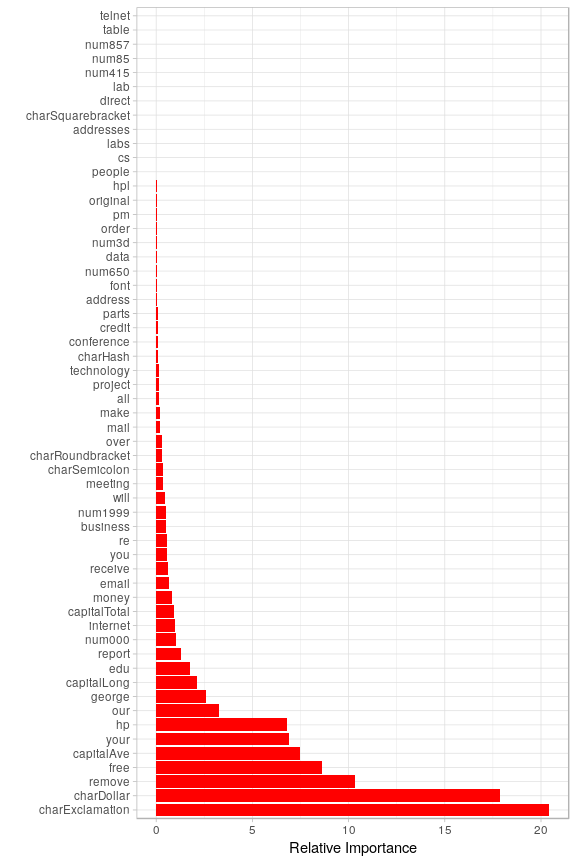
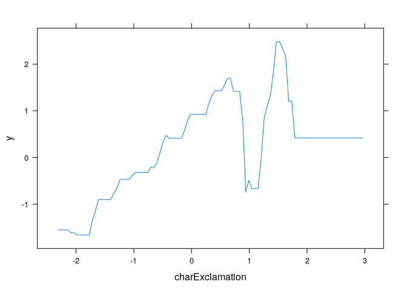
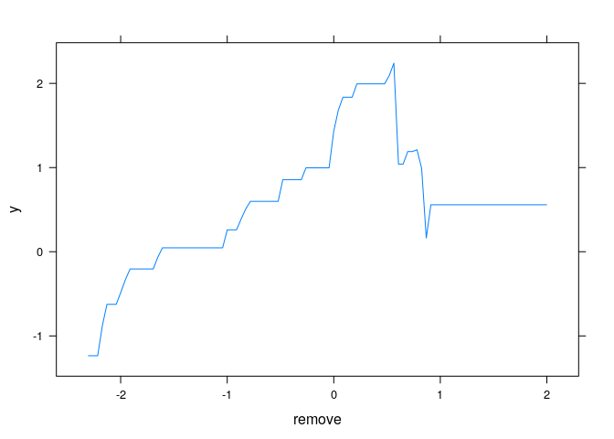
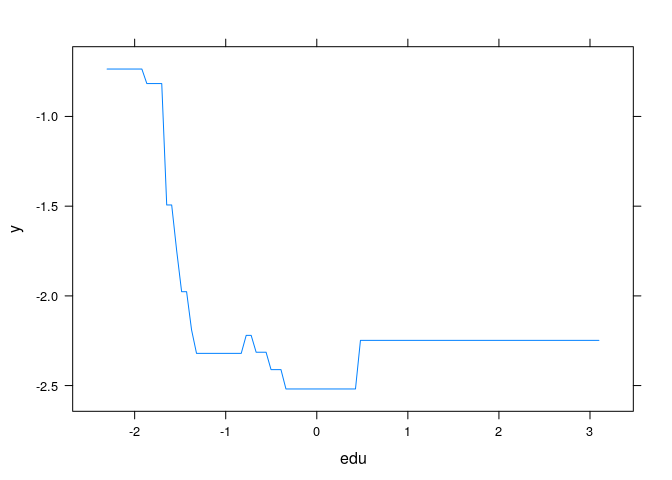

Chapter 10: Boosting and Additive Trees
================
Bodo Burger
2018-05

-   [AdaBoost](#adaboost)
    -   [Algorithm 10-1 AdaBoost.M1](#algorithm-10-1-adaboost.m1)
    -   [Figure 10-2 AdaBoost](#figure-10-2-adaboost)
-   [Loss functions](#loss-functions)
    -   [Figure 10-3 Exponential loss and AdaBoost](#figure-10-3-exponential-loss-and-adaboost)
    -   [Figure 10-4 Loss functions for binary classification](#figure-10-4-loss-functions-for-binary-classification)
    -   [Figure 10-5 Loss functions for regression](#figure-10-5-loss-functions-for-regression)
-   [Gradient Boosting Machine](#gradient-boosting-machine)
    -   [Figure 10-6 Relative importance](#figure-10-6-relative-importance)
    -   [Figure 10-7 Partial dependence](#figure-10-7-partial-dependence)
-   [Sources](#sources)

``` r
knitr::opts_chunk$set(echo = TRUE, message = FALSE,
                      cache = TRUE, cache.path = "cache/chapter10/",
                      fig.path = "figures/")
set.seed(123)
library("mlr")
library("ggplot2")
library("reshape2")
library("gbm")
theme_set(theme_light())
cbbPalette = c("#E69F00", "#56B4E9", "#009E73", "#F0E442", "#0072B2", "#D55E00", "#CC79A7")
```

AdaBoost
--------

### Algorithm 10-1 AdaBoost.M1

We start by implementing the AdaBoost.M1 (discrete AdaBoost):

``` r
#' Train AdaBoost.M1 model
#'
#' @param data data.frame Training dataset
#'        target variable needs to be in (1,-1)-coding as.factor
#' @param target character Name of the target variable
#' @param weak_learner A model training function
#' @param pred_fun Prediction function for the weak learner
#' @param M Number of boosting iterations
#'
#' @return Model object (list)
adaboost_m1_train = function(data, target, weak_learner,
    pred_fun = function(object, newdata) predict(object, newdata), 
    M = 200, ...) {
  alpha = numeric(M)
  n = nrow(data)
  w = rep(1/n, n)
  models = vector("list", M)
  for(m in 1:M) {
    models[[m]] = weak_learner(data, target, weights = w, ...)
    predictions.m = pred_fun(models[[m]], data)
    ind.miss = data[, target] != predictions.m
    err.m = sum(w * ind.miss) / sum(w)
    alpha[m] = log((1 - err.m) / err.m)
    w = w * exp(alpha[m] * ind.miss)
  }
  return(list(models = models, alpha = alpha))
}

#' Prediction function for AdaBoost.M1
#'
#' @param object Object created by adaboost_m1_train()
#' @param newdata data.frame
#'
#' @return Predictions
adaboost_m1_predict = function(object, newdata) {
  models = object$models
  alpha = object$alpha
  M = length(alpha)
  n = nrow(newdata)
  predictions = matrix(nrow=M, ncol=n)
  for (m in 1:M) {
    tmp.m = pred_weak_learner(models[[m]], newdata)
    predictions[m, ] = alpha[m] * as.numeric(levels(tmp.m))[tmp.m]
  }
  return(sign(colSums(predictions)))
}

#' Extract a model with M iterations from an AdaBoost.M1 object
adaboost_return_partial_model = function(object, M) {
  models = object$models[1:M]
  alpha = object$alpha[1:M]
  return(list(models = models, alpha = alpha))
}

#' Examplary weak learner: tree stump (rpart with maxdepth = 1)
weak_learner = function(data, target, weights = NULL, subset = NULL, maxdepth=1) {
  mod.stump = rpart::rpart(formula(paste0(target, "~ .")),
    data, weights = weights, subset = subset, control = 
    rpart::rpart.control(maxdepth=maxdepth, cp=-1, minsplit=1, minbucket=1, xval=0))
  return(mod.stump)
}
#' Prediction function for the tree stump
pred_weak_learner = function(object, newdata) predict(object, newdata, type = "class")
#' Predict random guesses
pred_random = function(object = NULL, newdata) {
  n = nrow(newdata)
  return(sample(c(-1,1), n, replace=TRUE))
}

calculate_test_error = function(model, data.test, target, pred_fun =
    function(object, newdata) predict(object, newdata)) {
  predictions = pred_fun(model, data.test)
  return(mean(predictions != data.test[,target]))
}
```

Now we replicate the simulation (pp. 339/340).

``` r
generate_data = function(n = 12000, d = 10) {
  X = replicate(d, rnorm(n))
  y = factor(ifelse(rowSums(X^2) > 9.34, 1, -1))
  return(data.frame(X, y))
}
sim.data = generate_data()
test.indices = rep(FALSE, nrow(sim.data)); test.indices[2001:nrow(sim.data)] = TRUE
fit.stump = weak_learner(sim.data, "y", subset = !test.indices)
fit.tree = rpart::rpart(y ~ ., sim.data, subset = !test.indices)
(test.error.stump = calculate_test_error(fit.stump, sim.data[test.indices, ], 
  "y", pred_fun = pred_weak_learner))
```

    ## [1] 0.4604

``` r
calculate_test_error(0, sim.data[test.indices, ], "y", pred_fun = pred_random) # random guess
```

    ## [1] 0.496

``` r
(test.error.tree = calculate_test_error(fit.tree, sim.data[test.indices, ], 
  "y", pred_fun = pred_weak_learner))
```

    ## [1] 0.253

After generating the data, we fit a tree stump and calculate the test error. We can see that the weak classifier is slightly better than random guessing (because the dataset is balanced random guessing should be roughly 0.5). Fitting a tree with default settings yields a test error of 0.253.

### Figure 10-2 AdaBoost

To replicate figure 10.2 we train a model using our implementation and 400 boosting iterations.

``` r
fit.ada = adaboost_m1_train(sim.data[!test.indices, ], "y", weak_learner = weak_learner,
  pred_fun = pred_weak_learner, M = 400, maxdepth = 2)
calculate_test_error(fit.ada, sim.data[test.indices,], "y", pred_fun = adaboost_m1_predict)
```

    ## [1] 0.0714

``` r
# extract test error for different number of boosting iterations:
iterations.seq = c(1, seq(20, 400, 10))
test.errors = numeric(length(iterations.seq))
for (i in seq_along(iterations.seq)) {
  partial.fit = adaboost_return_partial_model(fit.ada, iterations.seq[i])
  test.errors[i] = calculate_test_error(partial.fit, sim.data[test.indices,], "y",
    pred_fun = adaboost_m1_predict)
}
```

``` r
ggplot(data = data.frame(i = iterations.seq, y = test.errors), aes(x = i, y = y)) +
  geom_line(color = "orange") + ylim(0, .5) +
  geom_hline(yintercept = test.error.stump, linetype = "dotted") +
  geom_hline(yintercept = test.error.tree, linetype = "dotted") +
  annotate(geom = "text", x = 200, y = .48, label = "tree stump") +
  annotate(geom = "text", x = 200, y = .29, label = "tree with 14 terminal nodes") +
  xlab("Boosting iterations") + ylab("Test error")
```



To get below a test error of 0.1 (like in the book) we set the parameter maxdepth = 2. The test error decreases substantially compared to the training of a single, deep tree.

Loss functions
--------------

### Figure 10-3 Exponential loss and AdaBoost

``` r
iterations.seq = c(1, seq(20, 400, 10))
train.errors = numeric(length(iterations.seq))
train.losses = numeric(length(iterations.seq))
y.train = sim.data[!test.indices, "y"]
y.train = as.numeric(levels(y.train))[y.train]
for (i in seq_along(iterations.seq)) {
  partial.fit = adaboost_return_partial_model(fit.ada, iterations.seq[i])
  predictions = adaboost_m1_predict(partial.fit, sim.data[!test.indices,])
  train.errors[i] = mean(predictions != y.train)
  train.losses[i] = mean(exp(-y.train * predictions))
}
ggplot(data = data.frame(i = iterations.seq, y1 = train.errors, y2 = train.losses)) +
  geom_line(aes(x = i, y = y1), color = "darkred") + 
  geom_line(aes(x = i, y = y2), color = "blue") + 
  geom_hline(yintercept = 0, linetype = "dashed") +
  annotate(geom = "text", x = 200, y = .5, label = "Exponential Loss") +
  annotate(geom = "text", x = 200, y = .15, label = "MMCR") +
  coord_cartesian(ylim = c(0, 1)) + 
  xlab("Boosting iterations") + ylab("Training error")
```



*Figure 10.3* does not replicate. Why?

### Figure 10-4 Loss functions for binary classification

``` r
x = seq(-2, 2, .01) # margin
misclassificaion = function(x) sign(x)
exponential = function(x) exp(-x)
binom_deviance = function(x) log(1 + exp(-2*x))/log(2)
squared_error = function(x) (x - 1)^2
support_vector = function(x) ifelse(x<=1, 1-x, 0)

plot.data = melt(data.frame(yf = x, 
  Misclassification = 1*(x<0),
  Exponential = exponential(x),
  BinomialDeviance = binom_deviance(x),
  SquaredError = squared_error(x),
  SupportVector = support_vector(x)),
  id.vars = "yf", variable.name = "Type", value.name = "Loss")
ggplot(data = plot.data, mapping = aes(x = yf, y = Loss, color = Type)) +
  geom_line() + coord_cartesian(ylim = c(0, 3)) +
  scale_colour_manual(values=cbbPalette)
```



The curve for *Binomial Deviance* deviates (no pun intended). Why?

### Figure 10-5 Loss functions for regression

``` r
x = seq(-3, 3, .01) # margin
squared_error = function(x) (x)^2
absolute_error = function(x) abs(x)
huber_loss = function(x, delta = 1) ifelse(abs(x) <= delta, x^2, 2*delta*abs(x)-delta^2)

plot.data = melt(data.frame(margin = x, 
  SquaredError = squared_error(x),
  AbsoluteError = absolute_error(2*x),
  Huber = huber_loss(x, delta = 1.4)),
  id.vars = "margin", variable.name = "Type", value.name = "Loss")
ggplot(data = plot.data, mapping = aes(x = margin, y = Loss, color = Type)) +
  geom_line() + coord_cartesian(ylim = c(0, 9)) +
  scale_colour_manual(values=cbbPalette)
```



Gradient Boosting Machine
-------------------------

*work in progress*

``` r
getPrediction = function(model, testdata, n.trees) {
  pred = predict(model, newdata = testdata, n.trees = n.trees, type = "response")
  pred = as.numeric(pred > 0.5)
  return(pred)
}
getError = function(model, testdata, target.name, n.trees = "full", acc = FALSE) {
  if (n.trees == "full") n.trees = model$n.trees
  pred = getPrediction(model, testdata, n.trees)
  err = mean(pred != testdata[target.name])
  return(if(acc) 1-err else err)
}
```

``` r
data("spam", package = "kernlab")
df = spam
df$type = as.numeric(df$type) - 1 # gbm package requires 0-1 coding
# train / test split as in section 9.1.2:
set.seed(2048)
train.indices = sort(sample(nrow(spam), size = 3065, replace = FALSE))
# transformation of the predictors in section 9.1.2: log(. + .1)
df = data.frame(lapply(df[,-58], function(x) log(x + .1)), type = df$type)
df.train = df[train.indices, ]
df.test = df[-train.indices, ]
```

``` r
fit.gbm = gbm(type ~ ., distribution = "bernoulli", data = df.train,
  n.trees = 1000, interaction.depth = 1, shrinkage = 0.1, train.fraction = 1)
rel.inf.df = summary(fit.gbm, plotit = FALSE)
test.error = getError(fit.gbm, df.test, target.name = "type", n.trees = "full")
test.error
```

    ## [1] 0.05143229

Test error is 0.0514323.

### Figure 10-6 Relative importance

``` r
ggplot(rel.inf.df, aes(x = reorder(var, -rel.inf), y = rel.inf)) +
  geom_bar(stat='identity', fill = "red") + coord_flip() +
  xlab("") + ylab("Relative Importance")
```



### Figure 10-7 Partial dependence

``` r
plot(fit.gbm, i.var = "charExclamation")
```



``` r
plot(fit.gbm, i.var = "remove")
```



``` r
plot(fit.gbm, i.var = "edu")
```



``` r
#plot(fit.gbm, i.var = "hp", return.grid = TRUE)
```

``` r
plot(fit.gbm, i.var = c("hp", "charExclamation"), return.grid = TRUE) 
```

``` r
ind = seq(1, 1000, length.out = 100)
plot(ind, sapply(ind, function(x) getError(fit.gbm, df.test, target.name = "type", n.trees = x,
                                           return.accuracy = TRUE)),
     type = "l", xlab = "number of iterations", ylab = "accuracy")

# plots grid of 4 partial dependency plots

# histogram plot function for pairs plot
# you cannot use hist() because it creates its own plot
panel.hist = function(x, ...) {
  usr = par("usr"); on.exit(par(usr))
  par(usr = c(usr[1:2], 0, 1.5) )
  h = hist(x, plot = FALSE)
  breaks = h$breaks; nB = length(breaks)
  y = h$counts; y = y/max(y)
  rect(breaks[-nB], 0, breaks[-1], y, col = "cyan", ...)
}
pairs(df.train[, c("charExclamation", "charDollar", "remove", "free", "hp", "capitalAve",
                   "your", "capitalLong")], diag.panel = panel.hist, upper.panel = NULL)


# Figure 10.8, EoSL
grid = plot(fit.gbm, c("hp", "charExclamation"), return.grid = TRUE)

z = acast(grid, hp ~ charExclamation, value.var = "y")

hp = as.numeric(dimnames(z)[[1]])
charExclamation = as.numeric(dimnames(z)[[2]])

persp(x = hp, y = charExclamation, z = z, theta = 45)

library(plotly)
plot_ly(z = ~ z) %>% add_surface()

library(rgl)
open3d()
surface3d(hp, charExclamation, z, color = col, back = "lines")
#wire3d()


library(lattice)
wireframe(z)


#####################################################%
# Using mlr ####
tsk = makeClassifTask(data = data.frame(df.train[-58], type = as.factor(df.train$type)), target = "type", positive = 1)
getTaskDesc(tsk)

lrn.log = makeLearner("classif.logreg", predict.type = "prob")
lrn.gbm = makeLearner("classif.gbm", predict.type = "prob", n.trees = 20000, distribution = "bernoulli")

mod.log = train(lrn.log, tsk)
mod.gbm = train(lrn.gbm, tsk)

pred.log = predict(mod.log, newdata = df.test)
pred.gbm = predict(mod.gbm, newdata = df.test)
listMeasures(tsk)
performance(pred.log, measures = list(acc, mmce))
performance(pred.gbm, measures = list(acc, mmce))

#########################################################################################################%
# Generalized additive model from Chapter ####
#library(gam)
# formula.gam = formula(paste0("type ~ ", paste0("s(",names(df.train)[-58],', df=4)', collapse = " + ")))
# fit.gam = gam(formula.gam, data = df.train.trafo, family = binomial(link = logit))
# summary(fit.gam)
# predict(fit.gam, newdata = df.test.trafo, type = "")


# Illustration from Elements of Statistical Learning
# 10.14.1 California Housing
library(gbm)
library(readr)

df.org = read_csv("~/hidrive/Datasets/CaliforniaHousing/cal_housing.data")
population = df.org$population
households = df.org$households
df = data.frame(
  # target: median house value in the neighborhood
  HouseValue = df.org$medianHouseValue,
  # features:
  Population = population,
  MedInc = df.org$medianIncoe,
  Latitude = df.org$latitude,
  Longitude = df.org$longitude,
  AveOccup = population / households,
  AveRooms = df.org$totalRooms / households,
  AveBedrms = df.org$totalBedroms / households,
  HouseAge = df.org$housingMedianAge
)

fit = gbm(formula = HouseValue ~ ., data = df, shrinkage = .1)
summary(fit)
# recreating Figure 10.15
par(mfrow=c(2,2))
plot(fit, i.var = "MedInc", col = "green")
plot(fit, i.var = "AveOccup", col = "green")
plot(fit, i.var = "HouseAge", col = "green")
plot(fit, i.var = "AveRooms", col = "green")

plot(fit, i.var = c("AveOccup", "HouseAge"))

# mit MLR
tsk = makeRegrTask(data = df, target = "HouseValue")
```

Sources
-------
