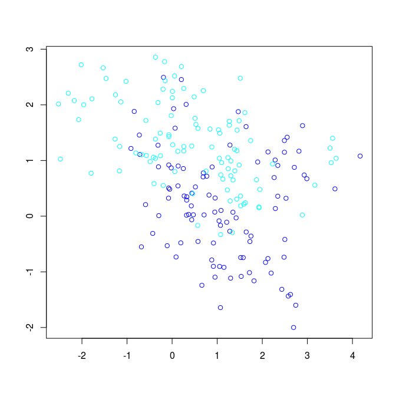

Chapter 2: Overview of Supervised Learning
================
Bodo Burger
2018-05-07

``` r
knitr::opts_chunk$set(echo = TRUE,
                      message = FALSE,
                      fig.path = "figures/")
set.seed(123)
library("mlr")
library("ggplot2")
library("ElemStatLearn")
```

Linear Models and Least Squares
===============================

The data is available from the ElemStatLearn package. We start by creating an MLR task and train the linear model to predict y.

``` r
me = ElemStatLearn::mixture.example
df = data.frame(x1 = me$x[,1], x2 = me$x[,2], y = me$y)
print(df[sample(200, 4),])
```

    ##              x1         x2 y
    ## 58  -0.07711446 0.50512168 0
    ## 157  3.16697155 0.55694663 1
    ## 81   0.47080879 0.02543855 0
    ## 174  1.94542944 0.48108050 1

``` r
tsk = makeRegrTask(data = df, target = "y")
lrn.lm = makeLearner("regr.lm")
mod.lm = train(lrn.lm, tsk)
betas = coefficients(getLearnerModel(mod.lm))
print(betas)
```

    ## (Intercept)          x1          x2 
    ##   0.3290614  -0.0226360   0.2495983

The function for the decision boundary is determined by the estimated coefficients of the model. We set the threshold to .5.

``` r
db = function(db.x1, coef = betas) {
  (coef[3])^-1 * (0.5 - coef[1] - coef[2] * db.x1)
}
```

Figure 2.1. Classification with linear regression
-------------------------------------------------

``` r
grid = expand.grid(x1 = me$px1, x2 = me$px2)
grid["y"] = factor(ifelse(grid$x2 > db(grid$x1), 1, 0))
db.x1 = c(min(me$px1), max(me$px1))
db.x2 = db(db.x1)
ggplot(show.legend = FALSE) + 
  geom_point(aes(x = grid$x1, y = grid$x2, col = grid$y), shape = 19, size = .2, alpha = .5, show.legend = FALSE) +
  geom_line(aes(x = db.x1, y = db.x2)) +
  geom_point(aes(x = me$x[,1], y = me$x[,2], col = factor(me$y)), shape = "O", size = 4, stroke = 2, show.legend = FALSE) +
  scale_colour_manual(values = c("deepskyblue", "orange")) +
  theme_void()
```



Sources
=======

-   R documentation of mixture.example data `?ElemStatLearn::mixture.example`
-   <https://stackoverflow.com/questions/39822505/drawing-decision-boundaries-in-r>
-   <https://stats.stackexchange.com/questions/21572/how-to-plot-decision-boundary-of-a-k-nearest-neighbor-classifier-from-elements-o>
