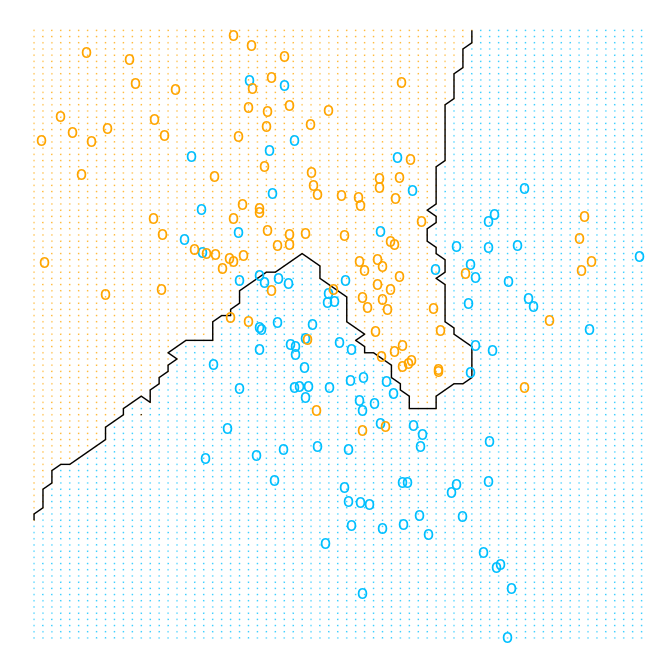
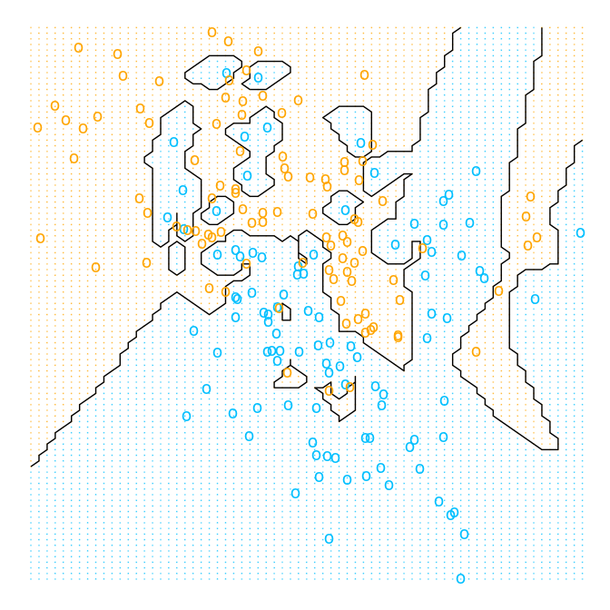

Chapter 2: Overview of Supervised Learning
================
Bodo Burger
2018-05

-   [Linear Model](#linear-model)
    -   [Figure 2.1. Classification using linear regression](#figure-2.1.-classification-using-linear-regression)
-   [Nearest-Neighbors Method](#nearest-neighbors-method)
    -   [Figure 2.2 Classification using 15-nearest-neighbors](#figure-2.2-classification-using-15-nearest-neighbors)
    -   [Figure 2.3 Classification using 1-nearest-neighbor](#figure-2.3-classification-using-1-nearest-neighbor)
-   [Sources](#sources)

``` r
knitr::opts_chunk$set(echo = TRUE,
                      message = FALSE,
                      fig.path = "figures/")
set.seed(123)
library("mlr")
library("ggplot2")
```

Linear Model
============

The data is available from the ElemStatLearn package. We start by creating an MLR task and train a linear model to predict y.

``` r
me = ElemStatLearn::mixture.example
df = data.frame(x1 = me$x[,1], x2 = me$x[,2], y = me$y)
knitr::kable(df[sample(200, 4),], row.names = FALSE)
```

|          x1|         x2|    y|
|-----------:|----------:|----:|
|  -0.0771145|  0.5051217|    0|
|   3.1669716|  0.5569466|    1|
|   0.4708088|  0.0254386|    0|
|   1.9454294|  0.4810805|    1|

``` r
tsk = makeRegrTask(data = df, target = "y")
lrn.lm = makeLearner("regr.lm")
mod.lm = train(lrn.lm, tsk)
beta = coefficients(getLearnerModel(mod.lm))
knitr::kable(t(beta))
```

|  (Intercept)|         x1|         x2|
|------------:|----------:|----------:|
|    0.3290614|  -0.022636|  0.2495983|

We create a grid of points covering all realizations of *x*<sub>1</sub> and *x*<sub>2</sub> in the feature space. For each point we make a model prediction. We set the threshold for the classification to .5.

``` r
knitr::kable(summary(df[, c("x1", "x2")])[c(1,6), ], row.names = FALSE)
```

|       x1       |       x2       |
|:--------------:|:--------------:|
| Min. :-2.52082 | Min. :-1.99985 |
| Max. : 4.17075 | Max. : 2.85581 |

``` r
grid = expand.grid(x1 = seq(-2.6, 4.2, .1), x2 = seq(-2.0, 2.9, .05))
y_hat = getPredictionResponse(predict(mod.lm, newdata = grid))
grid["y.lm"] = factor(as.numeric(y_hat > .5))
```

The function for the decision boundary is determined by the estimated coefficients of the model.

``` r
db = function(x1, coef = beta) {
  (coef[3])^-1 * (0.5 - coef[1] - coef[2] * x1)
}
```

Figure 2.1. Classification using linear regression
--------------------------------------------------

``` r
ggplot(show.legend = FALSE) + 
  geom_point(aes(x = grid$x1, y = grid$x2, col = grid$y.lm), shape = 20, size = .05, alpha = .5, show.legend = FALSE) +
  geom_line(aes(x = grid$x1, y = db(grid$x1))) +
  geom_point(aes(x = df$x1, y = df$x2, col = factor(df$y)), shape = "o", size = 4, stroke = 2, show.legend = FALSE) +
  scale_colour_manual(values = c("deepskyblue", "orange")) +
  theme_void()
```


Nearest-Neighbors Method
========================

We start with a 15-nearest-neighbor model.

``` r
tsk2 = makeClassifTask(data = data.frame(df[,1:2], y = factor(df$y)), target = "y")
lrn.knn15 = makeLearner("classif.knn", k = 15)
mod.knn15 = train(lrn.knn15, tsk2)
y_hat = getPredictionResponse(predict(mod.knn15, newdata = grid[, -3]))
grid["y.knn15"] = y_hat
```

Figure 2.2 Classification using 15-nearest-neighbors
----------------------------------------------------

``` r
ggplot(show.legend = FALSE) + 
  geom_point(aes(x = grid$x1, y = grid$x2, col = grid$y.knn15), shape = 20, size = .05, alpha = .5, show.legend = FALSE) +
  geom_contour(aes(grid$x1, grid$x2, z = as.numeric(grid$y.knn15)), col = "black", bins = 1) +
  geom_point(aes(x = df$x1, y = df$x2, col = factor(df$y)), shape = "o", size = 4, stroke = 2, show.legend = FALSE) +
  scale_colour_manual(values = c("deepskyblue", "orange")) +
  theme_void()
```



Now we train a 1-nearest-neighbor model.

``` r
lrn.knn1 = setHyperPars(lrn.knn15, k = 1)
mod.knn1 = train(lrn.knn1, tsk2)
y_hat = getPredictionResponse(predict(mod.knn1, newdata = grid[, 1:2]))
grid["y.knn1"] = y_hat
```

Figure 2.3 Classification using 1-nearest-neighbor
--------------------------------------------------

``` r
ggplot(show.legend = FALSE) + 
  geom_point(aes(x = grid$x1, y = grid$x2, col = grid$y.knn1), shape = 20, size = .05, alpha = .5, show.legend = FALSE) +
  geom_contour(aes(grid$x1, grid$x2, z = as.numeric(grid$y.knn1)), col = "black", bins = 1) +
  geom_point(aes(x = df$x1, y = df$x2, col = factor(df$y)), shape = "o", size = 4, stroke = 2, show.legend = FALSE) +
  scale_colour_manual(values = c("deepskyblue", "orange")) +
  theme_void()
```



Sources
=======

-   R documentation of mixture.example data `?ElemStatLearn::mixture.example`
-   <https://stackoverflow.com/questions/39822505/drawing-decision-boundaries-in-r>
-   <https://stats.stackexchange.com/questions/21572/how-to-plot-decision-boundary-of-a-k-nearest-neighbor-classifier-from-elements-o>
